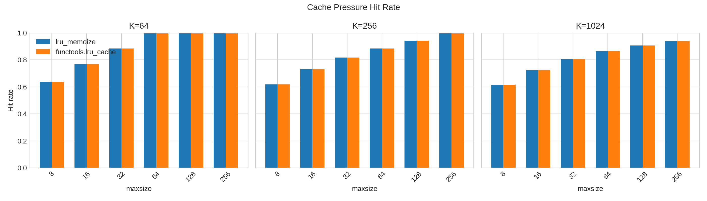
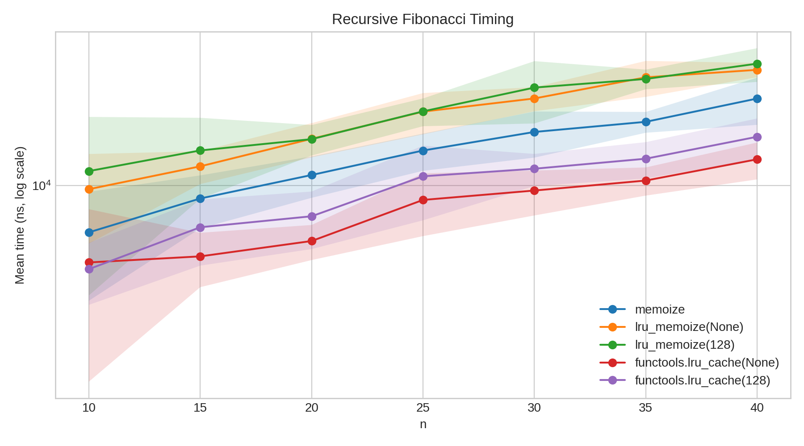
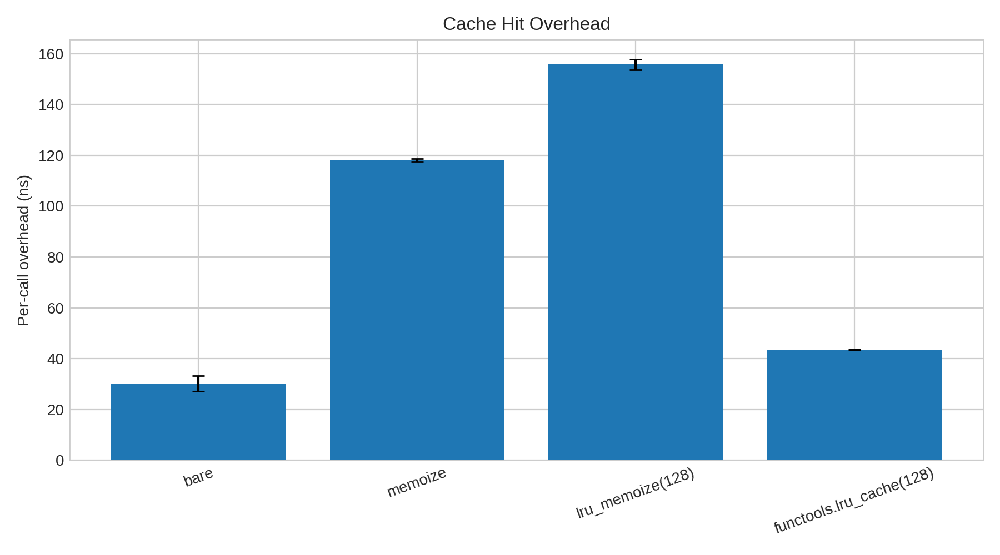

# Memoization and LRU Caching in Python

## 1. Introduction

Memoization stores previous function-call results so repeated calls with the same
arguments return immediately without recomputation. It is most effective for pure,
recursive workloads — Fibonacci, grid-path counting — where the same subproblems
recur exponentially without caching. An **unbounded** cache, however, grows
without limit for diverse inputs, effectively leaking memory. The **LRU**
(Least-Recently-Used) policy bounds this by evicting the entry accessed least
recently whenever the cache is full, exploiting the temporal locality present in
most real workloads.

This project implements and benchmarks two decorator variants from scratch and
compares them with CPython's `functools.lru_cache`. The workspace is structured
as follows:

```
lru-memoize-project/
├── src/
│   ├── naive_memoize.py        # Phase 1: unbounded dict-based memoize
│   ├── lru_memoize.py          # Phase 2: bounded LRU via OrderedDict
│   └── workloads.py            # Shared test functions
├── tests/                      # Correctness tests + cross-validation vs stdlib
├── experiments/                # Timing scripts (bench_*.py) + plot_results.py
├── results/                    # CSV outputs and figures
└── cpython_analysis/
    ├── _functoolsmodule.c      # CPython C source (local copy)
    └── execution_flow.md       # Detailed function-level execution traces
```

---

## 2. Implementation

Both decorators live in `src/` and expose the same interface as `functools.lru_cache`:
`cache_info()` and `cache_clear()` attached to the wrapper, and `functools.wraps`
applied so the original function's metadata is preserved.

### 2.1 Naive Unbounded Memoize

`src/naive_memoize.py` uses a plain `dict` closed over by the wrapper. The cache
key is `args` — a tuple of all positional arguments, which is hashable as long as
the arguments themselves are.

```python
def memoize(func):
    cache, hits, misses = {}, 0, 0

    @wraps(func)
    def wrapper(*args):
        nonlocal hits, misses
        if args in cache:
            hits += 1
            return cache[args]
        misses += 1
        result = func(*args)
        cache[args] = result
        return result

    wrapper.cache_info  = lambda: CacheInfo(hits, misses, None, len(cache))
    wrapper.cache_clear = ...   # resets dict, hits, misses
    return wrapper
```

### 2.2 Bounded LRU with OrderedDict

`src/lru_memoize.py` is a **decorator factory**: `lru_memoize(maxsize=128)`
returns a decorator, which in turn returns the wrapper. This three-level closure
nesting is required because `maxsize` is a decorator parameter, not a function
argument. `collections.OrderedDict` provides O(1) LRU maintenance: `move_to_end`
on a hit promotes the entry to MRU position; `popitem(last=False)` on a full-cache
miss evicts the LRU entry.

```python
def lru_memoize(maxsize=128):
    def decorator(func):
        cache = OrderedDict()
        hits = misses = 0

        @wraps(func)
        def wrapper(*args):
            nonlocal hits, misses
            if args in cache:
                hits += 1
                cache.move_to_end(args)
                return cache[args]
            misses += 1
            result = func(*args)
            if maxsize == 0:
                return result
            cache[args] = result
            if maxsize is not None and len(cache) > maxsize:
                cache.popitem(last=False)
            return result

        wrapper.cache_info  = lambda: CacheInfo(hits, misses, maxsize, len(cache))
        wrapper.cache_clear = ...
        return wrapper
    return decorator
```

### 2.3 Recursive Name Resolution

Defining a recursive function in one module and applying the decorator by
rebinding a different name causes recursive calls to bypass the cache, because the
body still resolves the original module-level name. The project avoids this with a
factory pattern:

```python
def make_fib(decorator):
    @decorator
    def fib(n):
        if n < 2: return n
        return fib(n-1) + fib(n-2)  # 'fib' here resolves to the decorated wrapper
    return fib
```

---

## 3. CPython Source Analysis

### 3.1 Two-Layer Architecture

`functools.lru_cache` is implemented in two files. `Lib/functools.py` defines
the public decorator factory and a pure-Python fallback `_lru_cache_wrapper`.
`Modules/_functoolsmodule.c` implements `_lru_cache_wrapper` as a compiled C
type. At the bottom of `functools.py`:

```python
try:
    from _functools import _lru_cache_wrapper  # C type replaces Python fallback
except ImportError:
    pass
```

In a standard CPython build the C accelerator is always present.

### 3.2 Pure-Python Fallback (`Lib/functools.py`)

`_lru_cache_wrapper` is a closure with three code paths selected once at
decoration time based on `maxsize`:

- **`maxsize == 0`** — call the function, count misses, return. No cache.
- **`maxsize is None`** — dict-only lookup. No list management.
- **Bounded** — dict for key→node lookup plus a circular doubly-linked list for
  recency order. Each node is `[PREV, NEXT, KEY, RESULT]`; a self-referential
  `root` sentinel acts as both head and tail.

The bounded hit path splices the node out of its current position and reattaches
it at the MRU end in six pointer assignments. The miss path runs the user function
*outside* the `RLock` to avoid blocking readers, then re-acquires the lock to
insert. When the cache is full, it recycles the LRU node in-place (writing the
new key/result over the old values and rotating `root` forward) rather than
allocating a new node — saving one allocation and one deallocation per eviction.

### 3.3 C Accelerator (`Modules/_functoolsmodule.c`)

The C implementation mirrors the Python structure with two key differences:

**`lru_list_elem` stores a cached hash:**
```c
typedef struct lru_list_elem {
    PyObject_HEAD
    struct lru_list_elem *prev, *next;  // borrowed links
    Py_hash_t hash;    // pre-computed; enables _KnownHash dict API — skips __hash__ on every lookup
    PyObject *key, *result;
} lru_list_elem;
```

**Wrapper selection happens once at construction (`lru_cache_new`):**
```c
if      (maxsize == None)  wrapper = infinite_lru_cache_wrapper;
else if (maxsize == 0)     wrapper = uncached_lru_cache_wrapper;
else                       wrapper = bounded_lru_cache_wrapper;

obj->root.prev = obj->root.next = &obj->root;  // self-referential sentinel
obj->wrapper = wrapper;
```

`lru_cache_call` (the `tp_call` slot) then dispatches with zero branching:
`return self->wrapper(self, args, kwds)`.

The `bounded_lru_cache_wrapper` follows the same two-critical-section structure
as the Python version. `Py_BEGIN_CRITICAL_SECTION` is a no-op under the GIL and
acquires a per-object mutex under free-threaded Python (PEP 703).

**Key building (`lru_cache_make_key`)** has a scalar fast path: for a single
`str` or `int` argument with no kwargs and `typed=False`, it returns the scalar
directly without allocating a tuple.

### 3.4 Comparison

| | This project | CPython Python | CPython C |
|---|---|---|---|
| Cache structure | `OrderedDict` | dict + linked list | `PyDict` + `lru_list_elem` |
| Hit — move to MRU | `move_to_end()` | 6 pointer writes | `extract_link` + `append_link` |
| Hash caching | no | no | yes (stored in node) |
| Keyword args | no | yes | yes |
| Thread safety | none | `RLock` | critical-section macros |

---

## 4. Experiments and Results

All timing uses `time.perf_counter_ns()`. Raw data is in `results/*.csv`;
figures are in `results/figures/`.

### 4.1 Cache Pressure and Hit Rate

A trivial function `f(x) = x²` is wrapped with each decorator. 100,000 calls
are drawn from a Zipfian distribution (`a=1.5`) over a key space of size `K`,
with the same random trace replayed for both variants. `maxsize` ranges over
`{8, 16, 32, 64, 128, 256}` and `K` over `{64, 256, 1024}`.

Hit rates matched exactly between `lru_memoize` and `functools.lru_cache` for
every `(maxsize, K)` pair, confirming correctness. Selected results:

| `maxsize` | `K` | Hit rate | `lru_memoize` (ms) | `functools` (ms) | Speedup |
|---|---|---|---|---|---|
| 8 | 64 | 0.639 | 31.4 | 12.3 | 2.6× |
| 64 | 1024 | 0.863 | 23.6 | 9.3 | 2.5× |
| 256 | 1024 | 0.941 | 22.2 | 8.6 | 2.6× |

The ~2.6× throughput gap is stable across all configurations, indicating it is
a fixed per-call overhead cost rather than a cache-size effect. When `maxsize ≥ K`
(e.g., `maxsize=64, K=64`) the hit rate converges to ~0.999 after warm-up;
Zipfian skew means a cache covering 6% of a 1024-entry key space still captures
86% of all accesses.



### 4.2 Recursive Fibonacci Timing

`fib(n)` is timed for `n ∈ {10…40}` with the cache cleared before each of 10
trials. Selected means:

| `n` | `memoize` | `lru_memoize(128)` | `functools(None)` | `functools(128)` |
|---|---|---|---|---|
| 10 | 6.3 µs | 11.5 µs | 4.7 µs | 4.4 µs |
| 30 | 17.0 µs | 26.3 µs | 9.5 µs | 11.8 µs |
| 40 | 23.6 µs | 33.3 µs | 13.0 µs | 16.2 µs |

All memoized variants grow near-linearly (O(n) unique subproblems), confirming
the cache collapses exponential recursion. `lru_memoize(128)` is 2.1× slower
than `functools.lru_cache(128)` at `n=40`, consistent with the cache-pressure
ratio. The bounded `functools` variant is slightly slower than its unbounded
counterpart because it maintains linked-list pointers on every hit even when no
eviction occurs.



### 4.3 Per-Call Cache-Hit Overhead

`identity(x) = x` is pre-warmed and then called 1,000,000 times (guaranteed hit)
for 20 trials per variant:

| Variant | Mean per call | vs. bare |
|---|---|---|
| Bare call | 30.0 ns | — |
| `functools.lru_cache(128)` | 43.6 ns | +13.6 ns |
| `memoize` | 118.1 ns | +88.1 ns |
| `lru_memoize(128)` | 155.7 ns | +125.7 ns |

The C accelerator adds only 13.6 ns per hit — barely more than a Python attribute
lookup — by replacing bytecode dispatch with direct C dict and pointer operations.
The Python `memoize` adds 88 ns (one dict lookup + counter increment + dict read
via CPython bytecode). `lru_memoize` adds a further 37 ns for `move_to_end`,
which is a C-level `OrderedDict` method but still invoked through Python's method
dispatch machinery. The 3.6× gap between `lru_memoize` and `functools.lru_cache`
isolates the cost of Python-level method dispatch on an otherwise identical O(1)
algorithm.



---

## 5. Conclusion

All three experiments converge on the same finding: the `OrderedDict`
implementation is algorithmically correct and behaviorally identical to the
standard library, but incurs a constant ~2.5–3.6× overhead from Python-level
method dispatch. The C accelerator eliminates that overhead by managing dict and
list state at the C level with no bytecode interpretation on the hot path.

Possible extensions include: adding `threading.Lock` for thread safety;
supporting keyword arguments via a composite key (matching `functools._make_key`);
implementing TTL eviction by storing insertion timestamps alongside each node;
and comparing LFU against LRU on the same Zipfian traces to quantify any
hit-rate advantage from frequency-based eviction.
